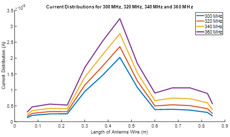

# Non-Uniform Monopole Antenna Analysis using Method of Moments (MoM)

## Overview
This project presents the electromagnetic modelling of a non-uniform monopole antenna using the Method of Moments (MoM) implemented in MATLAB.

The work investigates how antenna geometry, loading techniques, and excitation strategies influence current distribution, impedance characteristics, and radiation behaviour.

---

## Research Scope
- Thin-wire monopole antenna modelling
- Current distribution analysis
- Input impedance and admittance evaluation
- Radiation pattern computation
- Investigation of:
  - Reactive loading
  - Resistive loading
  - Multi-point excitation

---

## Relevance
This work provides a foundational framework for:
- MIMO antenna systems
- 5G / 6G wireless communication
- Compact antenna optimisation
- Electromagnetic simulation and modelling

---
## Results

### Current Distribution (Multi-Frequency Analysis)

The figure below shows the current distribution along the monopole antenna at different operating frequencies (300 MHz – 360 MHz).  
It demonstrates how current magnitude varies with both antenna length and frequency, highlighting the electromagnetic behaviour of the non-uniform monopole structure.

## Note
This MATLAB implementation forms part of my MSc dissertation on electromagnetic modelling of non-uniform monopole antennas using the Method of Moments (MoM).  

All simulations and validations were carried out during the research phase. The code is provided here to demonstrate the modelling approach, numerical implementation, and analysis methodology.

---

## Author
Olubunmi Adenekan  
Telecommunications Engineer | Antenna Research Enthusiast
